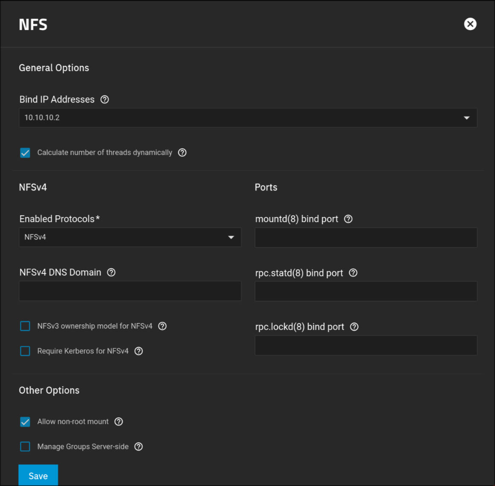
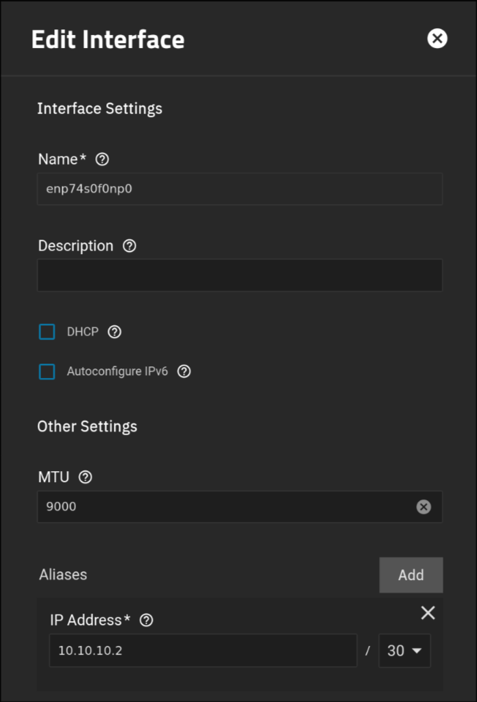

# NFS-RDMA Setup Guide (ARCHIVE, I No longer use RDMA, caused too many crashes at least with RoCE)

This guide explains how to enable NFS over RDMA between a Talos Linux client and a TrueNAS SCALE server. RDMA (Remote Direct Memory Access) allows for high-throughput, low-latency networking.

## Table of Contents

1. [Prerequisites](#prerequisites)
2. [Server Setup (TrueNAS SCALE)](#server-setup-truenas-scale)
3. [Client Setup (Talos Linux)](#client-setup-talos-linux)
6. [Helm Release Usage](#helm-release-usage)
7. [Cilium Consideration](#cilium-consideration)
8. [Additional Resources](#additional-resources)

---

## Prerequisites

- **NIC Support:** Ensure that both the server and client network interface cards (NICs) support RDMA. Without RDMA-capable NICs, this setup will not work. If a switch is between the two NICs, it will also need to support RDMA, which is why a direct connection is recommended.
- **Software:**
  - TrueNAS SCALE (Optional, any Server should be fine, but I only cover TNS)
  - Talos Linux
  - Cilium (optional, for network policies)

---

## Network Configuration

Since I am using a direct connection, I chose an IP space that was not being used. I went with `10.10.10.0/30`, giving us 2 active IP addresses. One for the server, one for Talos.

- **Subnet:** Use a `/30` subnet for the direct connection.
- **IP Addresses:**
  - **Server - TrueNAS SCALE:** `10.10.10.2/30`
  - **Client - Talos Linux:** `10.10.10.1/30`
- **MTU:** Personally, I set this to `9000` for both the server and the client

---

## Server Setup (TrueNAS SCALE)

### Enable RDMA

1. **Access the TrueNAS SCALE GUI:**
   - Navigate to `System Settings` > `Advanced` > `Init Shutdown Scripts`.

2. **Add a New Script:**
   - **Description:** NFS RDMA
   - **Type:** Command
   - **Command:**
     ```bash
     grep -Fxq "rdma 20049" /proc/fs/nfsd/portlist || echo "rdma 20049" >> /proc/fs/nfsd/portlist
     ```
   - **When:** Post Init

### Network Settings
My Mellanox has two ports, one is connected to the switch for LAN and WAN, the other is directly connected to the client (Talos) and has the following settings:



### NFS Service Configuration

**Navigate to NFS Service Settings:**
  - Go to `System Settings` > `Advanced` > `Services`.
  - Click the **Pencil Icon** to the right of the **NFS** service to edit its settings.
  

### Cron Job

Since TrueNAS SCALE does not support RDMA by default, theres a chance that the portlist is reset.. I have ran into this, which has unfortunately caused me to create a cronjob that runs every 5 mintues to ensure the RDMA port is in the port list..

This is likely not needed if you are not using TrueNAS SCALE.

1. **Access the TrueNAS SCALE GUI:**
   - Navigate to `System Settings` > `Advanced` > `Cron Jobs`.

2. **Add a New Script:**
   - **Description:** Ensure RDMA
   - **Run As User:** root
   - **Command:**
     ```bash
     grep -Fxq "rdma 20049" /proc/fs/nfsd/portlist || echo "rdma 20049" >> /proc/fs/nfsd/portlist
     ```
   - **Schedule:** `*/5 * * * *`

---

## Client Setup (Talos Linux)

### Network Settings

Configure the network interfaces in the Talos configuration:

```yaml
machine:
  network:
    hostname: heavy-control
    interfaces:
      # Outbound
      - deviceSelector:
          hardwareAddr: b8:3f:d2:48:88:2e
        mtu: 9000
        dhcp: true
        vip:
          ip: 192.168.200.16
      # Direct Connect to TrueNAS
      - deviceSelector:
          hardwareAddr: b8:3f:d2:48:88:2f
        addresses:
          - 10.10.10.1/30
        mtu: 9000
        dhcp: false
    disableSearchDomain: true
```

### NFS Client Configuration

Configure NFS mount options by overwriting `/etc/nfsmount.conf`:

```yaml
machine:
  files:
    - op: overwrite
      path: /etc/nfsmount.conf
      permissions: 420
      content: |
        [ NFSMount_Global_Options ]
        hard=True
        proto = rdma
        port = 20049
```

Note: Pretty much everything unlisted, such as the version, (r|w)size are all auto-negotiated to the highest value, so I ommit them from my config.
Additionally, atime mount options have no affect on NFS.
Ref: https://man7.org/linux/man-pages/man5/nfs.5.html
---

## Helm Release Usage

Configure your Helm releases to use NFS with RDMA:

```yaml
media:
  type: nfs
  server: 10.10.10.2
  path: /mnt/tank/media/library
  globalMounts:
    - path: /media
      readOnly: true
```

---

## Cilium Consideration

If using Cilium for layer 2 announcements, set the `Outbound` (Non RDMA NIC) as the interface:

```yaml
# https://docs.cilium.io/en/latest/network/l2-announcements
apiVersion: cilium.io/v2alpha1
kind: CiliumL2AnnouncementPolicy
metadata:
  name: l2-policy
spec:
  loadBalancerIPs: true
  # Specify the Non RDMA interface
  interfaces:
    - enxb83fd248882e
  nodeSelector:
    matchLabels:
      kubernetes.io/os: linux
```

## Additional Resources

- [NVIDIA Enterprise Support: How to Configure NFS over RDMA (RoCE)](https://enterprise-support.nvidia.com/s/article/howto-configure-nfs-over-rdma--roce-x)

  **Note:** The documentation is a bit outdated, ignore the instructions regarding the module loading on the client, as the module is either deprecated or included in the kernel now. You should not have to load any additional modules. 
